# Loan Approval Classification (Logistic Regression)

## 📊 Exploratory Data Analysis (EDA)

We analyzed the dataset to understand feature distributions, relationships, and detect outliers.

### 1. Loan Status Distribution
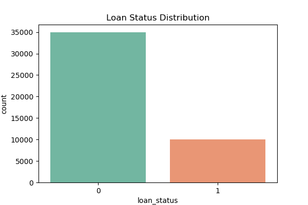  
The dataset is slightly imbalanced, with more approved loans than rejected ones.

### 2. Categorical Features
Example: **Loan Intent**
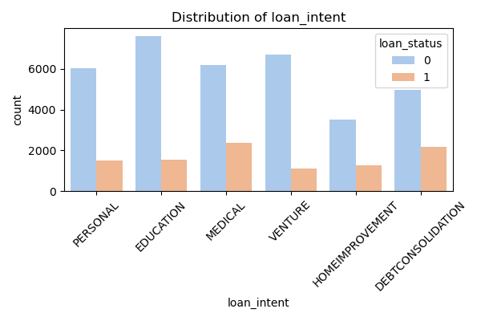  
Most loans are for **Education** and **Medical** purposes, with varying approval rates.

### 3. Numerical Features
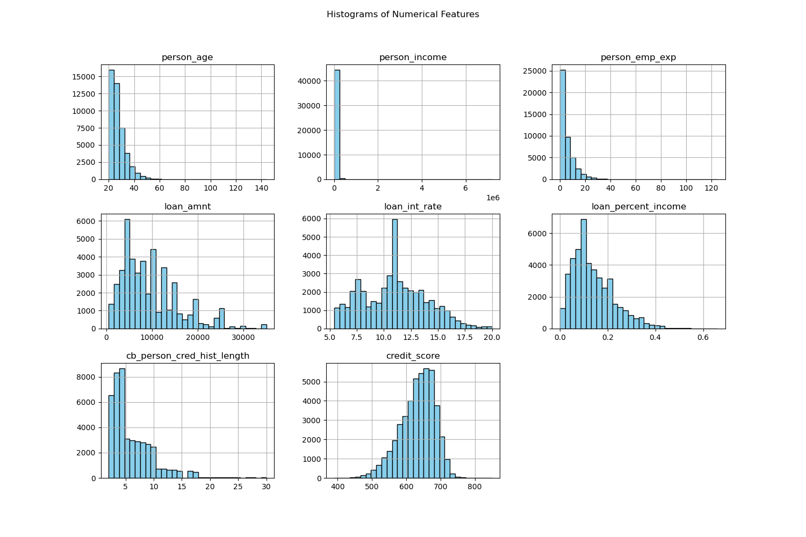  
Income, credit score, and loan amount show skewed distributions.

### 4. Correlation Matrix
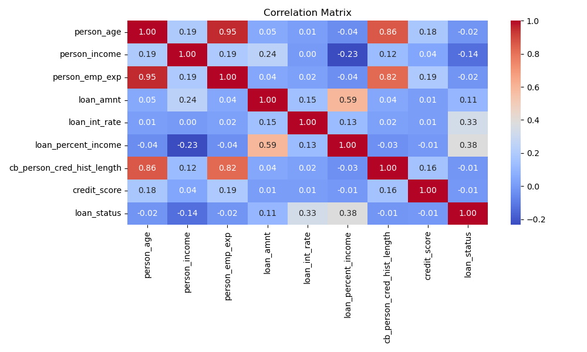  
Credit score and interest rate have a strong negative correlation.

### 5. Outliers

Outliers were detected using the **Z-score method** (threshold = 3).  
Below are boxplots highlighting outliers for each numerical feature.

#### 1. Person Age

#### 2. Person Income
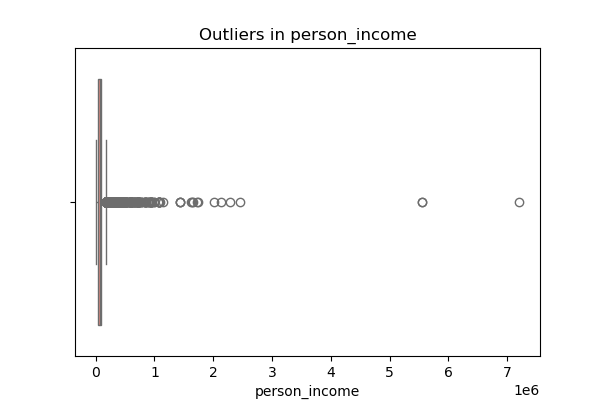

#### 3. Employment Experience
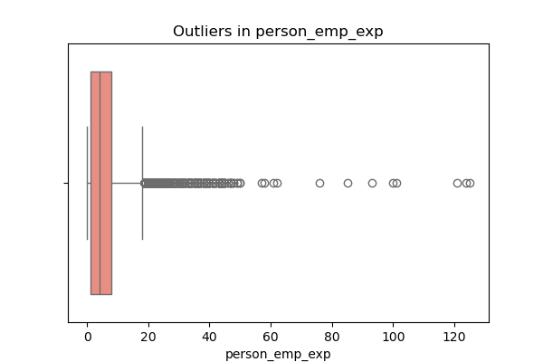

#### 4. Loan Amount
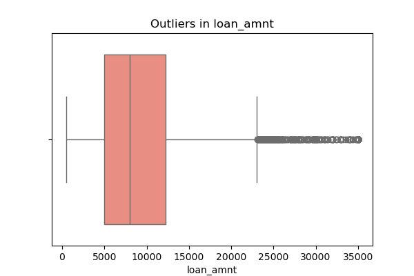

#### 5. Loan Interest Rate
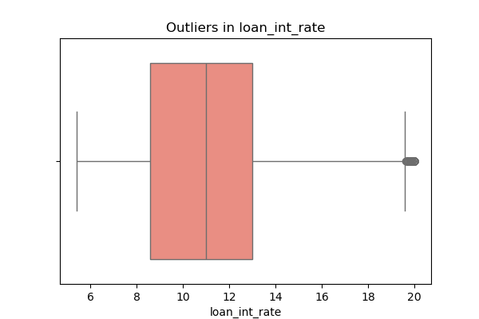

#### 6. Loan Percent Income
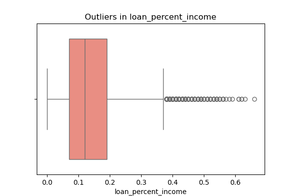

#### 7. Credit History Length
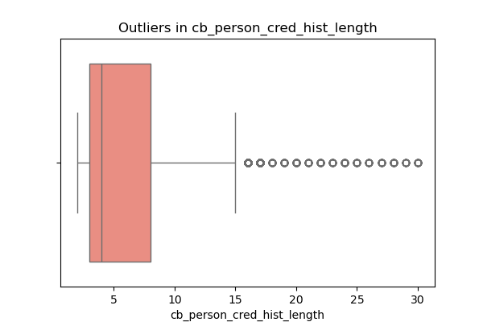

#### 8. Credit Score
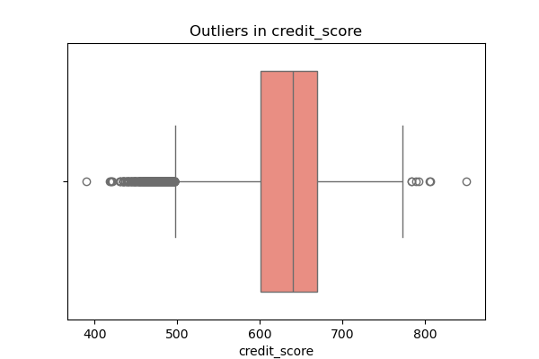

---

**Summary of Outliers (Count per Feature)**  
See [`artifacts/outlier_report.txt`](artifacts/outlier_report.txt) for the number of detected outliers per numerical column.
---

## 📈 Skewness Handling
We measured skewness for each numerical feature and applied **Yeo-Johnson transformation** to normalize distributions.  
This helps Logistic Regression perform better.

**Before Transformation:**  
Highly skewed distributions were present in `person_income`, `loan_amnt`, and `credit_score`.

**After Transformation:**  
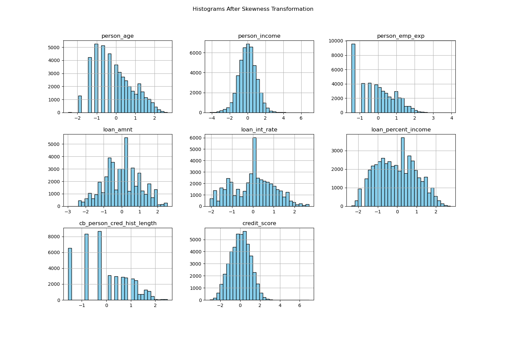  
All numerical features now show a more symmetric distribution.

---

## 🚨 Outlier Treatment
We used the **IQR method** to detect and cap outliers for each numerical feature.  
This prevents extreme values from overly influencing the model.

---
## Train-Test Split
   - 80% training, 20% testing.
   - Stratified split to maintain class balance in both sets.

---
## Feature Scaling & Encoding*
   - **StandardScaler** for numerical columns.
   - **OneHotEncoder** for categorical columns (drop first to avoid dummy trap).
   - Applied **only after splitting** to avoid data leakage.

## 🗂 Artifacts
All generated plots and reports are stored in the [`artifacts/`](artifacts/) folder for reference.
